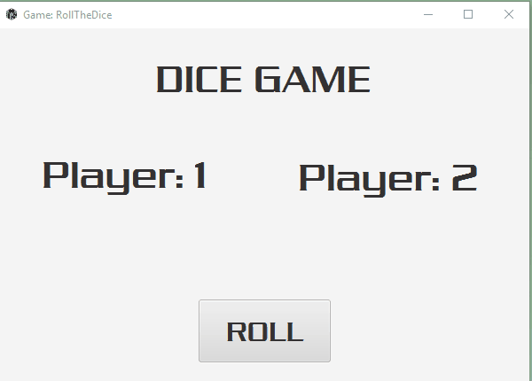

## Front-End (Lab/Homework)  --> Checkout My Personal Front-End Projects [Repo](https://github.com/azanaebondbrooks/frontend-mania-repo)
- EmojiBomb
    - [Live Demo](https://emojibombstories.netlify.com/) -  Exercise: Build a simple webpage
		- [Code Repo](https://bitbucket.org/itsjustnae/emojibomb-lab1/src/master/) - Bitbucket
- RockPaperScissors Challenge
    - [Live Demo](https://rockpaperscissorschallenge.netlify.com/) -  Exercise: Make a RockPaperScissors Game
		- [Code Repo](https://bitbucket.org/itsjustnae/rockpaperscissors-lab2/src/master/) - Bitbucket
- CSS Homework
    - [Live Demo](https://piechart.netlify.com/) -  Exercise: Build a Pie Chart
		- [Code Repo](https://bitbucket.org/itsjustnae/piechart-hw1/src/master/) - Bitbucket
    - [Live Demo](https://mastheadcss.netlify.com) - Exercise: Build Masthead
		- [Code Repo](https://bitbucket.org/itsjustnae/navbar-hw1/src/master/) - Bitbucket
- JS Libraries (Under Construction)
    - [Live Demo](https://jslibraries.netlify.com/) - Exercise: Visualize and inspect the results of the different library operations 
		- [Code Repo](https://bitbucket.org/itsjustnae/jslibraries-lab2/src/master/) - Bitbucket
- Bootstrap and MVC, MVVM (Under Construction)
    - [Live Demo](https://bootstraphw.netlify.com/) - Exercise: Create a basic html page. It should include the jQuery library. Add some simple content
       - [Code Repo](https://bitbucket.org/itsjustnae/bootstraphw/src/master/) - Bitbucket
## Java (Lab/Homework) --> Checkout My Personal Java Projects [Repo](https://github.com/azanaebondbrooks/java-mania-repo)
- Java Type And Variables
    * Compiled View
         
       - [Code Repo](https://bitbucket.org/itsjustnae/types-variableslab/src/master/) -  Exericise: Using Test Cases in JUnit to understand datatype instances
- Dice Game 
    * Compiled View
        - 