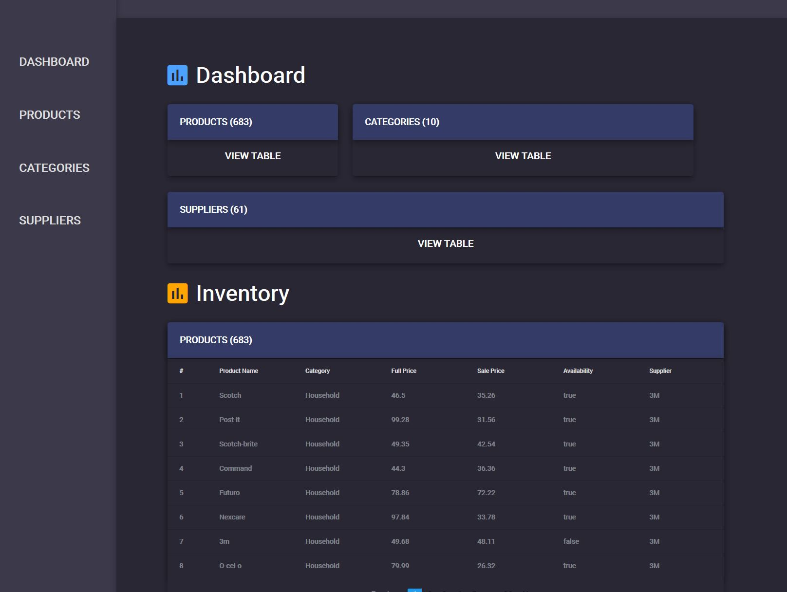

## TTS Dashboard | [Live Demo]()

A product dashboard, used internally by a company, that uses a RESTful API service, an SQL database and a front end built with Angular.

 

**Project Assigned:** 09/19/2019  
**Project Due:** 10/04/2019  
**Project Completed:** 10/04/2019

---

### Tools, Technologies & Plugins Used

| Languages | Frameworks & Libraries | IDEs & Tools  | Plugins        |
| ------------- | ------------------ | ------------- | -------------- | 
| Java          | Spring Boot        | IntelliJ IDEA | ngx-pagination |
| TypeScript    | Spring Data JPA    | VS Code       | material-icons | 
| SQL           | Spring Web         | Git           |                |
|               | Angular            | GitHub        |                |
|               | Bootstrap 4        | Heroku        |                |
|               | Lodash             |               |                |

## Original Project Instructions

For the project, imagine you have been tasked with building a product dashboard that your company will use internally. There are a few requirements:

- Create a RESTful API service to add, update, and retrieve product information
- Uses Hibernate to interact with a SQL database
- Utilizes Angular on the front-end 

- Each product is a record with the following columns:
  - id: unique identifier
  - name
  - category: ID relating to category table
  - full_price: up to two places of decimal
  - sale_price: up to two places of decimal
  - availability: boolean value stating is the product is in stock (true) or not (false)
  - supplier: ID relating to supplier table

- The MVP will be able to :
  - Perform basic CRUD functions ***IN PROGRESS*** - TEST ***REST API*** IN POSTMAN ***WORKING***
  - Return a list of products by category ***IN PROGRESS***
  - Return a list of products by category and availability ***IN PROGRESS***
  - Sort products by full price, sale price, and the percentage of discount ***IN PROGRESS*** - PAGINATION - ***WORKING***

- At the end of the project, you should have two parts: 
  - a Java Spring Boot application handling your RESTful API
  - a simple front-end application that interacts and displays the data from your API