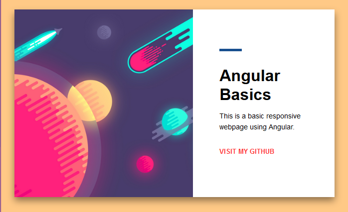

# Myangularproject

This project was generated with [Angular CLI](https://github.com/angular/angular-cli) version 8.1.2.

- [Live Demo](https://myangularproject.netlify.com/) - Exercise: Build a Simple Web Application in Angular
       - [Code Repo](https://bitbucket.org/itsjustnae/myangularproject/src/master/) - Bitbucket
## Build

Run `ng build` to build the project. The build artifacts will be stored in the `dist/` directory. Use the `--prod` flag for a production build.

This project uses simple responsive design using css flexblox.
